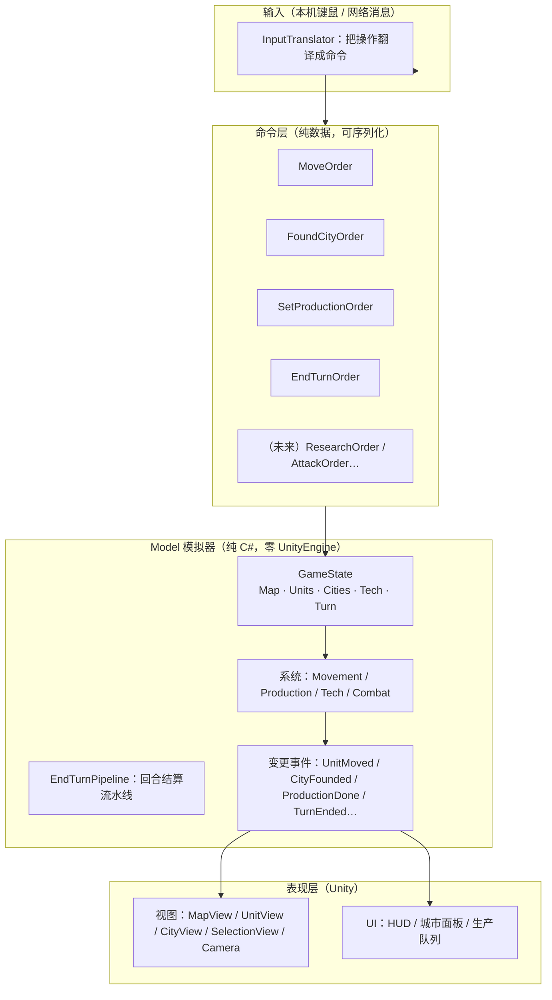

# 星火纪元（SparkAge）架构设计

> 本文档描述目标架构，是后续开发的蓝图。
> 关联：docs/notes.md（决策记录）、docs/progress.md（进度）。

## 1. 定位与架构目标

- 简化版《文明6》求职 demo。核心卖点：**回合制架构 + 联机链路**。
- 架构目标（按优先级）：
  1. **状态单一**：Model 的 GameState 是唯一事实源；
  2. **变更受控**：所有状态变更走"命令 → 系统执行"；
  3. **可测试**：Model 纯 C#，能单测；
  4. **可序列化**：GameState 可打包 → 联机；
  5. **UI/表现可扩展**：城市、生产、科技等系统按同一模式落位，不"面多加水"。

## 2. 分层总览



- **命令**：玩家意图，纯数据；单机在本地执行，联机发给主机执行——**同一条代码路径**。
- **Model**：校验命令 + 执行系统 + 改状态 + 产出事件。表现层不知道"怎么改"，只消费事件刷新自己。

## 3. 各层职责

### 3.1 Model（纯 C#，唯一的"世界"）
- `GameState`：世界状态容器（Map、Units、Cities、Tech、TurnNumber、CurrentPlayer）；
- **实体**（纯数据）：`Unit`、`City`、`TileData`、`PlayerState`（玩家个人状态：城市上限、金币、科技进度、是否出局）、`TechProgress`；
- **系统**（操作状态的纯逻辑）：`MovementSystem`、`ProductionSystem`、`TechSystem`、`CombatSystem`；
- **命令入口**：`GameState.Execute(Order)` → 校验（回合对不对、归属对不对、目标合不合法）→ 调对应系统 → 返回变更事件列表；
- `EndTurnPipeline`：回合结算按固定顺序跑（见 §5）；
- **序列化**（W5）：整个 GameState 可打包/还原。

### 3.2 命令层（纯数据，可序列化）
- 为什么存在：**单机与联机的公共接口**。联机时把"本地执行"换成"发主机执行"，Model 不改。
- 命令清单草案（先实现前两个，其余随功能加）：
  - `MoveOrder { UnitId, Target }`
  - `EndTurnOrder`
  - `FoundCityOrder { SettlerId }`（W3.2）
  - `SetProductionOrder { CityId, ItemId }`（W3.2）
  - 未来：`ResearchOrder`、`AttackOrder`…
- 校验职责在 Model，不在命令本身：命令只是"我想做什么"。

### 3.3 表现层（Unity，不写规则）
- `InputTranslator`：把键鼠/网络输入翻译成命令，不直接调视图；
- **视图**（纯显示，只读 Model 状态 + 消费事件）：MapView（地形）、UnitView、CityView、SelectionView（高亮/范围）、CameraController；
- **UI 层**：HUD、城市面板——只读状态展示 + 发命令按钮；
- **UI 状态**（选中哪个单位、相机在哪、高亮）**不属于 Model**，留在表现层——联机不同步这些。

## 4. 一次操作的完整旅程（例：右键移动单位）

1. `InputTranslator` 检测右键 + 目标格；
2. 构造 `MoveOrder { unitId, target }`；
3. 单机：本地执行；联机：发给主机（W5）；
4. Model 校验（当前回合、单位归属、目标可达、未被占）→ `MovementSystem` 改状态；
5. Model 产出事件 `UnitMoved { unitId, path }`；
6. 表现层收到事件：UnitView 沿 path 播动画；SelectionView 刷新范围；HUD 更新移动力。

> 关键：**步骤 4-5 不依赖任何 Unity 代码**，可在单测里直接跑。

## 5. 回合推进：EndTurnPipeline

`EndTurn` 不是"一个 for 循环"，是一条**有序流水线**（每个阶段一个系统，可单独测试）：

```
1. BeginTurn：回合开始标记（未来多人：轮到谁）
2. ProductionSystem：每座城 +生产力 → 完成队列项 → 产出单位/建筑（事件）
3. TechSystem：科技进度 +研究点（事件：科技完成）
4. MovementSystem：所有单位 MovementLeft = MaxMovement
5. CombatSystem：战后清理（未来）
6. TurnNumber++ → 事件 TurnEnded
```

## 6. 联机映射（W5 预告，先留接口）

- **主机权威**：只有主机跑 Model 执行命令；
- 客户端：InputTranslator → 命令 → 序列化发主机；
- 主机：校验执行 → 把变更广播（两种粒度，demo 建议后者）：
  - 粒度 A：广播整个 GameState（小状态，每回合/每操作一次，简单）；
  - 粒度 B：广播事件流（更省，但要客户端做增量还原）；
- 客户端表现层消费事件/状态刷新视图——**和单机是同一套视图代码**。

## 7. 从现状到目标的迁移（增量，不推翻重来）

现状已具备雏形：`GameState.MoveUnit` / `EndTurn` 本质就是"命令方法"。迁移按步走，每步可验证：

1. **定义命令层**：Order 数据类型 + `GameState.Execute(Order)` 统一入口（把 MoveUnit/EndTurn 收进来）；
2. **引入事件**：Model 操作返回事件列表；表现层改为"消费事件刷新"，去掉跨组件直接调用；
3. **抽 InputTranslator**：输入不再由 MapView 分发，改为"输入 → 命令"；
4. **W3.2 起按新模式落位**：City 实体 + ProductionSystem + FoundCityOrder/SetProductionOrder，城市第一次出现就用新结构，不再迁第二次。

> 纪律：**不搞大爆炸重写**。一次只迁一步，每步功能照常跑。W3.2 是第一个"生在新架构上"的功能，用来验证模式。

## 8. 状态归属速查（防止再混）

| 状态 | 归属 | 联机同步？ |
|---|---|---|
| 地图/单位/城市/科技/回合 | Model GameState | ✅ |
| 选中哪个单位、高亮、范围 | 表现层（UI 状态） | ❌ |
| 相机位置/朝向 | 表现层 | ❌ |
| 单位移动动画进度 | 表现层 | ❌（只同步结果，不同步动画） |
| 当前操作（命令） | 命令层（瞬态） | 客户端→主机传输 |

## 9. 与面试话术的对应

- "我的输入层只产生命令，Model 校验执行，单机和联机走同一条路径" —— 架构能力；
- "整个游戏状态在纯 C# 层，可序列化、可单测" —— 分层与可测试性；
- "回合结算是一条有序流水线，每个系统独立可测" —— 工程化思维。


## 10. 落地形态：MVC 风格 + 表现层事件总线（最终约定 2026-09）

- **Model** = Model（纯 C#，不感知 View/EventBus）：GameState + 实体 + 规则方法（返回结果对象）。
- **Controller** = `GameController`（唯一）：装配视图、收输入（键鼠/AI/联机=输入源）、调 Model、读结果、编排视图。
- **View** = MapView / UnitView / CityView / SelectionView / CameraController：纯显示，被 Controller 调用或订阅事件。
- **EventBus**（Game 层，静态服务）：表现层内部解耦。异步完成 & 跨组件反应走事件；单一接收方的直接动作走方法调用。Model 不发布也不订阅事件。
- 通信规则：
  1. 输入 → GameController（不直接进 View）；
  2. GameController → Model 方法（命令），Model 返回结果；
  3. GameController 读结果 → 调对应 View；
  4. View 的异步完成（如移动动画结束）→ EventBus.Publish → 关心者订阅；
  5. UI 只读 Model 状态 + 订阅事件 + 向 Controller 发请求。
- 初始事件集：UnitMoveFinishedEvent、TurnEndedEvent（后续按需加）。

## 11. 项目结构（最终约定）

### 事件中心的位置（先回答：在哪层）
- **EventBus 在 Game 表现层**：`Assets/Scripts/Game/EventBus.cs`，namespace `SparkAge.Game`，静态服务类。
- **绝不在 Model**。Model 不引用、不发布、不订阅任何事件。
- 原因：Model 必须保持纯 C#（可单测、可序列化、联机可复用）。事件是"表现层的通知机制"，业务结果用方法返回值表达。
- **总线只走"通知"，不走"请求"**：请求（命令）是 Controller 直接调 Model 方法；总线只广播"发生了什么"（动画完成、回合结束）给关心者。

### 目录树
```
Assets/Scripts/
├─ Model/                         Model：纯 C#，零 UnityEngine
│  ├─ Hex/          HexCoord HexLayout Pathfinding TileData
│  ├─ Map/          MapData MapGenerator ValueNoise
│  ├─ Units/        Unit UnitType
│  ├─ Cities/       City（W3.2a-1）
│  ├─ Players/      PlayerState（W3.2a-1）
│  ├─ GameRules.cs  数值常量
│  ├─ GameState.cs  世界状态 + 规则方法（MoveUnit/EndTurn/FoundCity…）
│  └─ Serialization/（W5）
├─ Game/                         表现层：Controller + Views + Service（允许 UnityEngine）
│  ├─ GameController.cs          唯一 Controller：装配/输入/调 Model/编排
│  ├─ EventBus.cs                事件中心（静态服务）
│  ├─ GameEvents.cs              表现层事件类型
│  ├─ MapView.cs                 视图：地形渲染
│  ├─ UnitView.cs                视图：单位
│  ├─ CityView.cs                视图：城市（W3.2a-1）
│  ├─ SelectionView.cs           视图：选择/高亮（原 SelectionController，改名）
│  ├─ CameraController.cs        视图：相机（自管相机输入，不碰 Model）
│  ├─ HexMeshFactory.cs          工具：3D 网格
│  └─ UI/                        （以后）HUD / 城市面板
├─ Editor/Tests/                 单测（EditMode）
```

### 命名约定
- **唯一带 Controller 的 = GameController**（表现层的"控制"集中于此）。
- 其余表现层类按角色命名：View（Map/Unit/City/Selection）、Service/Tool（EventBus、HexMeshFactory）、Camera 例外保留 CameraController（自管相机输入，不碰 Model）。

### 依赖规则（箭头 = 允许引用）
```
Model  ←  Game（Controller/View 读 Model）
GameController → Views、Model、EventBus
Views 之间互不引用：异步完成→EventBus；需要编排→GameController
EventBus ← 任何 Game 组件（订阅/发布）
UI（以后）→ EventBus（订阅）+ GameController（发请求）
```
禁止：Model 引用 Game；View 引用 View；View 直接调 Model 改状态（编排一律经 GameController）。

## 12. MVC 定稿目录（用户拍板 2026-09；§10/§11 以本节为准）

### 目录与命名空间
```
Assets/Scripts/
├─ Framework/                 基础设施（可引用 UnityEngine）
│  ├─ EventCenter/  EventCenter.cs（总线）+ EventDefine.cs（事件定义）
│  ├─ Singleton/    MonoSingleton<T>（基类，备用）
│  ├─ ObjectPool/   （通用池，先占位/可选实现）
│  └─ Hex/          HexLayout.cs（hex↔世界转换，Unity 数学）+ HexMeshFactory.cs（3D 网格工具）
├─ Model/                     业务数据层（纯 C#，零 UnityEngine）
│  ├─ Hex/          HexCoord.cs · TileData.cs · Pathfinding.cs
│  ├─ Map/          MapData.cs · MapGenerator.cs · ValueNoise.cs
│  ├─ Units/        Unit.cs（+UnitType）
│  ├─ Cities/       City.cs（W3.2a-1）
│  ├─ Players/      PlayerState.cs（W3.2a-1）
│  ├─ GameRules.cs · GameState.cs
│  └─ Serialization/（W5）
├─ View/                      表现层（场景视图 + 未来 UI）
│  ├─ MapView.cs · UnitView.cs · SelectionView.cs（原 SelectionController 改名）
│  ├─ CityView.cs（W3.2a-1）· CameraController.cs
│  └─ UI/（以后 HUD/面板）
└─ Controller/                逻辑控制层
   └─ GameController.cs（唯一控制器；未来 AI/输入适配器作为输入源放这里）
```
命名空间 = 目录：SparkAge.Framework(.EventCenter/.Singleton/.ObjectPool/.Hex)、SparkAge.Model(.Hex/.Map/.Units/...)、SparkAge.View、SparkAge.Controller。

### 依赖规则
- Model：零依赖（不引用 UnityEngine、不引用其他三层）。
- Framework：可引用 UnityEngine；EventDefine 是唯一例外，可引用 Model 类型作事件载荷（实用妥协）。
- View：引用 Model + Framework；View↔View 不直接引用（异步→EventCenter，编排→Controller）。
- Controller：引用 Model + View + Framework；是唯一"调 Model 改状态"的地方，View 只读。
- 事件语义：EventCenter 只走"通知"（动画完成/回合结束/需刷新）；命令 = Controller 直接调 Model 方法（未来联机包 Order 对象）。

### 现有文件迁移表
| 现在 | 迁到 | 备注 |
|---|---|---|
| Model/GameState.cs | Model/GameState.cs | 命名空间 SparkAge.Model |
| Model/Hex/HexCoord.cs | Model/Hex/ | 纯 struct |
| Model/Hex/TileData.cs | Model/Hex/ | |
| Model/Hex/Pathfinding.cs | Model/Hex/ | 纯逻辑 |
| Model/Hex/HexLayout.cs | Framework/Hex/ | 用 UnityEngine，属转换工具 |
| Model/Map/* | Model/Map/ | MapData/MapGenerator/ValueNoise |
| Model/Units/* | Model/Units/ | |
| Model/Cities、Players | Model/ | W3.2a-1 |
| Game/MapView.cs | View/ | 后续缩为纯地形 |
| Game/UnitView.cs | View/ | |
| Game/SelectionController.cs | View/SelectionView.cs | 类改名 |
| Game/CameraController.cs | View/ | 视图（相机自管输入） |
| Game/HexMeshFactory.cs | Framework/Hex/ | 工具 |
| Game/EventBus.cs·GameEvents.cs（若已建） | Framework/EventCenter/ | 并入 EventCenter/EventDefine |
| Scripts/test.cs | 删除 | 临时文件 |

### 迁移执行（两阶段提交，每阶段可编译可运行）
1. **阶段一「搬家」**：建目录 → Unity 内移动文件（保持 .meta/GUID，场景引用不断）→ 改 namespace + using → SelectionController 改名 SelectionView → 删 test.cs。验收：行为不变、单测绿。
2. **阶段二「收口」**：建 EventCenter/EventDefine → 建 Controller/GameController.cs → 把输入与编排从 MapView 抽到 GameController（MapView 缩为纯地形；View 不再直接调 Model 改状态；异步完成走 EventCenter）。验收：行为不变，结构符合上图。

## 13. 网络方案（W5 落地，位置与选型 2026-09）

- 选型：**Mirror**（社区开源，消息模型最贴本项目：纯 C# 状态 + 命令中继）。NGO 曾考虑：其 NetworkObject/NetworkVariable 惯用法与"状态在纯 C# Model"摩擦大，弃。
- 用法：Mirror 仅作传输层（连接管理 + NetworkMessage 收发）。禁止把游戏状态做成 Mirror 的 NetworkBehaviour/同步变量——状态保持在纯 C# Model，Mirror 只传"序列化命令"和"序列化 GameState"。
- 模式：**主机权威 + 命令中继 + 整状态广播（瘦客户端）**。主机跑完整 Model 执行每条命令，执行后把整个 GameState 序列化广播；客户端发命令、收状态、刷 View。
- 代码位置：Model/Serialization/（GameState/命令序列化，纯 C#，LitJson）+ Controller/NetworkSession.cs（封装 Mirror，可替换）。
- 接缝：W4 AI 先抽出 GameController 的"命令接缝"（SubmitOrder）；W5 网络复用同一接缝（客户端模式 = 命令发给主机）。
- 演示网络：本机双客户端 / 局域网直连。


